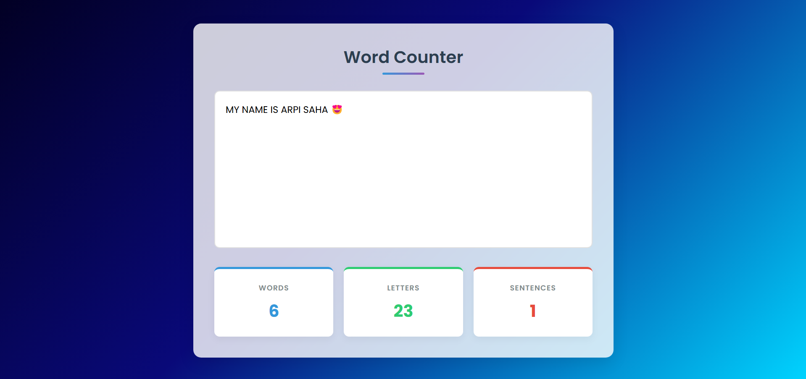

# 📝 Word Counter

### Live demo: https://iamarpisaha.github.io/word-counter/



A lightweight, real-time word counter web application that analyzes text as you type, providing instant counts of words, letters, and sentences.

## ✨ Features

- **Real-time text analysis** - Instant updates as you type
- **Multiple metrics**:
  - ✅ Word count
  - 🔤 Character count (including spaces)
  - 📝 Sentence detection
- **Clean, modern UI** with responsive design
- **Zero dependencies** - Pure HTML, CSS, and JavaScript
- **Fast and lightweight** - Minimal resource usage

## 🚀 Usage

1. Type or paste text into the input box
2. Watch counters update in real-time:
   - **Words**: Counts space-separated terms
   - **Letters**: All characters (including spaces)
   - **Sentences**: Detects sentences ending with . ! or ?

## 🛠️ Technical Implementation

```javascript
// Core counting logic
textArea.addEventListener("input", (event) => {
  const inputStr = event.target.value.trim();

  // Letter count (all characters)
  letterCountElem.innerText = inputStr.length;

  // Word count (handles multiple spaces)
  wordCountElem.innerText = inputStr.split(/\s+/).filter((word) => word).length;

  // Sentence count
  sentenceCountElem.innerText = inputStr
    .split(/[.!?]+/)
    .filter((word) => word).length;
});
```

## 📦 Installation

No installation needed! Simply:

1. Clone the repository:
   git clone https://github.com/iamarpisaha/word-counter.git

2. Open `index.html` in any modern browser

Or use directly via GitHub Pages.

## 🌟 Future Enhancements

- Paragraph counting
- Reading time estimation
- Dark/Light mode toggle
- Text statistics (most used words, etc.)
- Export results option

## 🤝 Contributing

Contributions welcome! Please:

1. Fork the project
2. Create your feature branch
3. Commit your changes
4. Push to the branch
5. Open a pull request

📜 License
MIT License - see LICENSE for details.
